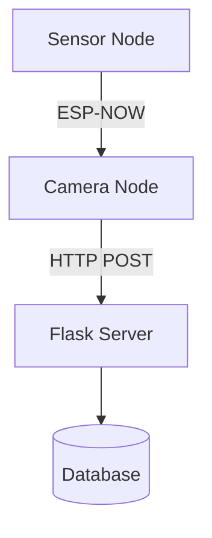

Here's the markdown code for your `README.md` with properly formatted code blocks:

```markdown
# Livestock Monitoring System

This repository contains code for two ESP32-based devices:
1. **Sensor Node**: Collects RFID, weight, temperature, and humidity data
2. **Camera Node**: Captures images and sends combined data to a Flask server

## Sensor Node Code
```cpp
#include <Wire.h>
#include <Arduino.h>
#include <HX711.h>
#include <SPI.h>
#include <SD.h>
#include <MFRC522.h>
#include <RTClib.h>
#include <map>
#include <esp_now.h>
#include <WiFi.h>
#include "AHT20.h"

// Pin Configuration
#define I2C_SDA      21
#define I2C_SCL      22
#define DOUT_PIN     32
#define CLK_PIN      14
#define SD_CS        5
#define RFID_CS      15
#define RST_PIN      27
#define SPI_SCK      18
#define SPI_MISO     19
#define SPI_MOSI     23
#define DETECT_LED   2

// ... [rest of sensor node code] ...

void loop() {
  // Main loop implementation
}
```

## Camera Node Code
```cpp
#include <esp_now.h>
#include <WiFi.h>
#include "esp_wifi.h"
#include "esp_camera.h"
#include <HTTPClient.h>
#include <ArduinoJson.h>
#include <base64.h>

// Camera pin definitions
#define PWDN_GPIO_NUM       32
#define RESET_GPIO_NUM      -1
// ... [other pin definitions] ...

// ... [rest of camera node code] ...

void loop() {
  // Main loop implementation
}
```

## System Architecture


## Key Features
- **RFID Identification**: Scans animal tags and identifies sex
- **Environmental Monitoring**: Measures weight, temperature, and humidity
- **Data Logging**: Stores records on SD card with timestamps
- **Wireless Communication**: Uses ESP-NOW for sensor-camera communication
- **Image Capture**: Takes photos when sensor data is received
- **Cloud Integration**: Sends data to Flask server via WiFi

## Setup Instructions
1. **Hardware Configuration**:
   - Connect sensors to ESP32 according to pin definitions
   - Install required libraries (HX711, MFRC522, RTClib, AHT20)
   
2. **Calibration**:
   - Update `HX711_CALIBRATION_A1` and `HX711_CALIBRATION_A0` for weight sensor
   - Add known RFID UIDs to `rfidSexMap`

3. **Networking**:
   - Set correct receiver MAC in sensor code
   - Configure WiFi credentials in camera code
   - Update Flask server URL

4. **Deployment**:
   - Upload sensor code to ESP32 with sensors
   - Upload camera code to ESP32-CAM
   - Start Flask server

## Troubleshooting
- **SD Card Errors**: Ensure proper CS pin configuration
- **ESP-NOW Failures**: Verify MAC addresses match
- **Image Capture Issues**: Check camera initialization
- **WiFi Connection**: Confirm credentials and network availability

> **Note**: The RTC module requires battery backup for persistent timekeeping
```

This markdown provides:
1. Clean code formatting with proper syntax highlighting
2. System architecture diagram using Mermaid
3. Key features overview
4. Step-by-step setup instructions
5. Troubleshooting section
6. Important notes highlighted

The code blocks are properly delimited with triple backticks and language identifiers (`cpp`) for syntax highlighting. The mermaid diagram visually represents the data flow between components. For best results:
1. Save this as `README.md` in your project root
2. Use a markdown viewer that supports Mermaid diagrams (like GitHub or VS Code with Mermaid extension)
3. Update the calibration values and network settings according to your specific hardware configuration
